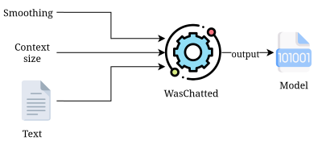
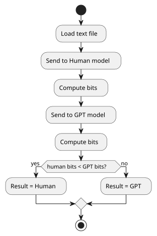

> [!NOTE]  
> WasChatted is a program developed for a university project. 

# WasChatted
WasChatted is a program designed to determine if a given text was written by a human or ChatGPT,
using pre-trained models which are FCMs (Finite Context Model), more specifically, Markov
models.
There are two functionalities:
- Train
- Analyse

## Training
The train functionality uses a text file to train the model. Upon completing the training, a binary
file is created so it can be used by the user to analyse the desired text file.
There are three main parameters to train the model:
- Text file (dataset)
- Context size (k)
- Smoothing (alpha)

The training process saves the counting of symbols of a given context.
For example, let’s consider the following text excerpt "AABBABBBBAAA", and the desired size of the context is 2.
In this scenario the resulting table would be

|    | A | B |
|:--:|:-:|:-:|
| AA | 1 | 1 |
| AB | 0 | 2 |
| BA | 1 | 1 |
| BB | 0 | 2 |

Once the process is completed, this table is stored on a binary file, alongside the context size used and the smoothing value.

> [!NOTE]  
> We later noted that this parameter didn't need to be specified here and that it didn't need to be saved on the binary file. It only needed to be specified in the analyse functionality, giving more flexibility to the user. However, we decided not to change because we were at the deadline and had already generated a lot of binaries.

## Analysing
This functionality uses the pre-trained models to determine if the provided text was written by a
human or ChatGPT. This function compares the text provided with the contexts and characters
stored in the pre-trained models and determines which one is the most likely.
There are three important parameters for this function:
- Text file to be analysed
- Human model
- ChatGPT model

Note that the models don't need to have been trained with the same parameters, i.e. the same context size and smoothing values.

The analysis is done through the "compression" of a text file by both models. The result is given by the model that requires less bits after the compression. The compression is done through probability estimation

$$
P(e|c) \approx \frac{N(e|c)}{\displaystyle\sum_{s\in\Sigma}N(s|c)}
$$

Where *e* is the character to be compressed, *c* is the context in which the character appeared, and *s*
is every character that appeared in context *c*.
However, to avoid divisions by zero, the smoothing parameter is introduced

$$
P(e|c) \approx \frac{N(e|c) + \alpha}{\displaystyle\sum_{s\in\Sigma}N(s|c) + \alpha * |\Sigma|}
$$

After calculating the probability, the program calculates the number of bits for that probability

$$
B = -\log{_2}{P}
$$

This is done to every character on the text file provided, which gives the total amount of bits
required to represent the compressed version of the file.

This process is done by both models and the model that requires the smaller number of bits is the
answer. 
The smaller number of bits required means that the contexts and characters
of contexts on the text file, are similar to the contexts of that model.

